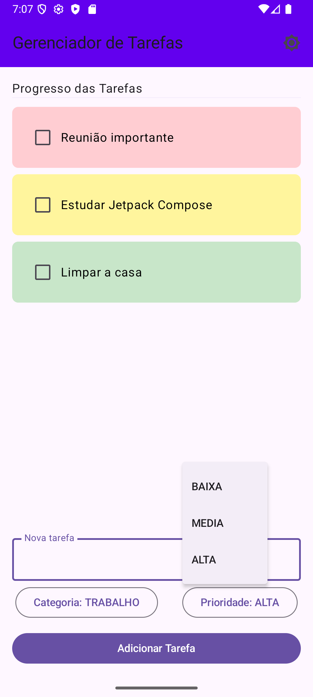
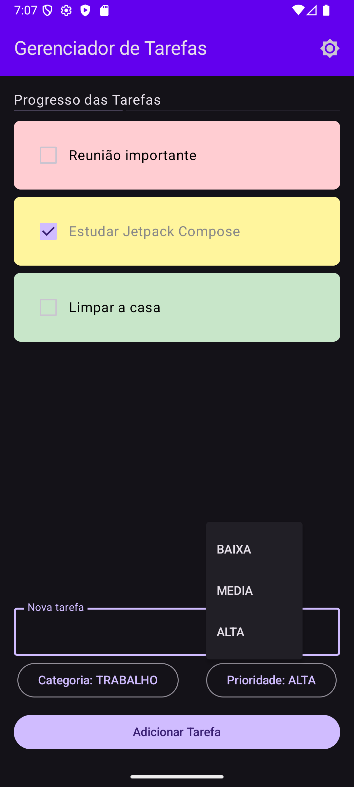

# TasksManagerApp

Aplicativo de gerenciamento de tarefas desenvolvido com Jetpack Compose e Kotlin, como parte do curso de Desenvolvimento de Software para Dispositivos Móveis da Universidade Federal do Ceará - Campus Quixadá.

## 📄 Funcionalidades

* Adicionar tarefas com categoria e prioridade
* Marcar tarefas como concluídas
* Excluir tarefas com opção de desfazer
* Indicador de progresso das tarefas
* Alternar entre tema claro e escuro (modo noturno)

## 📚 Tecnologias Utilizadas

* [Kotlin](https://kotlinlang.org/)
* [Jetpack Compose](https://developer.android.com/jetpack/compose)
* [ViewModel](https://developer.android.com/topic/libraries/architecture/viewmodel)
* [DataStore Preferences](https://developer.android.com/topic/libraries/architecture/datastore)

## 📑 Estrutura do Projeto

```
TasksManagerApp/
├── app/
    └── src/
        └── main/
            ├── java/com/example/tasksmanagerapp/
            │   ├── MainActivity.kt
            │   ├── model/Task.kt
            │   ├── datastore/DataStoreUtils.kt
            │   ├── viewmodel/TasksViewModel.kt
            │   └── ui/TasksScreen.kt
            └── res/
```

## 🚀 Executando o Projeto

1. Clone este repositório:

   ```bash
   git clone https://github.com/nauancastro/TasksManagerApp.git
   ```

2. Abra o projeto no **Android Studio**.

3. Certifique-se de que o `build.gradle` está com as dependências corretas.

4. Execute o app em um emulador ou dispositivo físico.

## 🌌 Capturas de Tela

| Tema Claro                          | Tema Escuro                           |
| ----------------------------------- | ------------------------------------- |
|  |  |

## 🙋‍ Apoio

Este projeto foi desenvolvido como parte das atividades da disciplina **QXD0276 - Desenvolvimento de Software para Dispositivos Móveis**, ministrada pelo professor **Francisco Victor da Silva Pinheiro** na **UFC - Campus Quixadá**.
